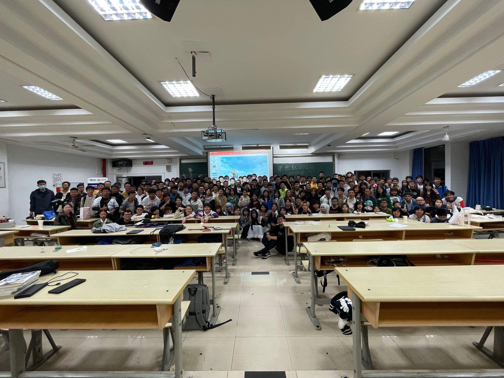

hello大家好啊，这里是水晶

上次这么玩的如此尽兴还是在高二学农的“名场面复刻大赛”。我仍记得毛毛雨中加急的排练，仍记得简陋的道具和校服出演的尴尬。记忆会模糊，情感会被时间冲淡，但这份热爱，从不会离我远去。

从零散坐在教室后排靠窗的位置时的拘谨，到DNA混剪时的激情四射，放飞自我，在短短2小时内，有各部门负责人的述职，有女装大佬在线整活，有二次元浓度检测器，有宅舞，有热歌，有WOTA艺，也有爆燃MAD。无论新生老生，无论厨的是哪部番，是舟批还是原批，在那一刻，所有人都是动漫社的一员。

正如动漫社的前辈所说，即使当时只有7人，也阻止不了他们对动漫的热爱。我们因热爱聚于此，因为热爱可以跨越时间，跨越记忆。时光流转，岁月如梭，十几年来，我已不复当年的热情，不会去网络上为自己的观点对喷，像一个新手一样，对游戏里的一切充满好奇和探索欲，像一个老道但无趣的人一样。但我不会忘记，不会丢下对生活的热爱。那些曾经的好奇，坚持，不懈。虽然剩下的不多，但多多少少还有。

我在这里记录下我的回忆，记录下曾经的快乐，希望永远不会被时间埋没。

