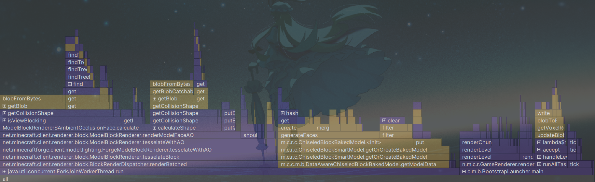
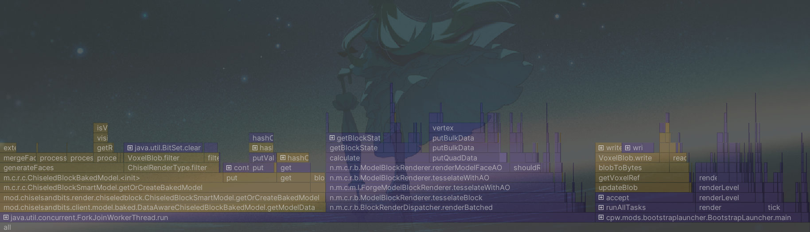

在分析器火焰图中，能看到blobFromBytes方法占据了大量的时间，但是方法中的运算时间又极少，查阅内存分配会发现大量的内存被分配在了新的VoxelBlob实例上。VoxelBlob是用来储存二进制体素数据的类，它需要一个BitSet(4096)，也就是16^3来储存数据，吃掉了大量的内存，而这很快引起gc，并消耗CPU时间。

想要优化只能从源头处找到是哪里在新建VoxelBlob实例，在分析器中可以看到游戏在blobFromBytes的底下是renderModelFaceAO，这个方法的作用是渲染带环境光遮蔽的面，看起来无可厚非。

但是仔细观察调用链会发现，怎么在calculateShape的时候，里面的isCollisionShapeFullBlock方法也要新建VoxelBlob对象，判断是否为完整方块为什么要拿到全部的体素数据

``` java
   @Deprecated
   public boolean isCollisionShapeFullBlock(BlockState pState, BlockGetter pLevel, BlockPos pPos) {
      return Block.isShapeFullBlock(pState.getCollisionShape(pLevel, pPos));
   }
```

isShapeFullBlock是一个静态方法，用来将拿到的方块VoxelShape，也就是方块碰撞箱与预设好的完整方块碰撞箱SHAPE_FULL_BLOCK_CACHE进行比对，来得出这个方块是否为完整方块。这个过程中自然要拿到该雕刻方块的碰撞箱，也就会通过查找该雕刻方块的方块实体对象，然后拿到对应的VoxelBlob，再拿到对应的VoxelShape。

但是这完全没有必要，我只需要在雕刻方块初始化的时候，把是否为完整方块写进blockstate里面，然后让mc直接按着blockstate进行判断不就好了。

但是这套判断方法不能通过覆写Block类的方法修改，只能对isCollisionShapeFullBlock方法进行mixin

``` java
@Mixin(BlockBehaviour.class)
public class MixinBlockBehaviour {
    @Inject(at = @At(value = "HEAD"),method = "isCollisionShapeFullBlock", cancellable = true)
    private void isCollisionShapeFullBlock(BlockState pState, BlockGetter pLevel, BlockPos pPos, CallbackInfoReturnable<Boolean> cir) {
        if (pState.is(ModBlocks.CHISELED_BLOCK.get())) {
            boolean isFull = pState.getValue(FULL_BLOCK);
            cir.setReturnValue(isFull);
        }
    }
}
```
先判断是否为雕刻方块，后直接按着blockState进行判断，避免了生成大量VoxelBlob的实例，如果不是，返回原版逻辑进行普通判断

最后，得到了优化后新的火焰图。
