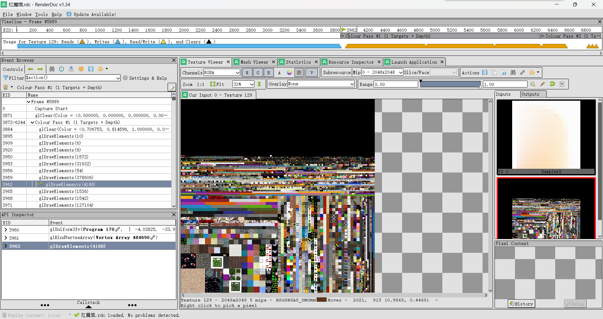
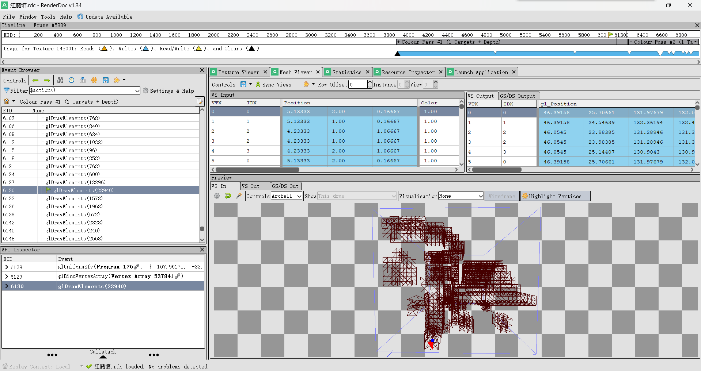

RenderDoc是一个很常用的渲染辅助工具，这里聊聊使用RenderDoc查看mc的部分经验

# 附加RenderDoc
这里借用千九博客里的内容，介绍如何在开发环境下附加RenderDoc

在gradle中，添加如下任务，其中`E:\\RenderDoc\\renderdoccmd.exe`替换为本地电脑上对应的RenderDoc的路径

``` gradle
tasks.register("runWithRenderDoc", Exec) {
    def javaExecTask = tasks.withType(JavaExec).named("runClient").get()
    def javaHome = javaExecTask.javaLauncher.get().metadata.installationPath.asFile.absolutePath

    commandLine = [
            "E:\\RenderDoc\\renderdoccmd.exe",
            "capture",
            "--opt-hook-children",
            "--wait-for-exit",
            "--working-dir",
            ".",
            "$javaHome/bin/java.exe",
            "-Xmx64m",
            "-Xms64m",
            "-Dorg.gradle.appname=gradlew",
            "-Dorg.gradle.java.home=$javaHome",
            "-classpath",
            "gradle/wrapper/gradle-wrapper.jar",
            "org.gradle.wrapper.GradleWrapperMain",
            "runClient"
    ]
}
```

这样就可以在`RenderDoc`中`Attach To Running Instances`中找到你的Java程序并正确附加

# RenderDoc内容

使用f12截取内容后，可以一窥mc的渲染管线是如何从无到有为你渲染出整个眼前的世界的

在`TextureViewer`界面，我们展开左侧`Event Browser`中的内容，便可逐条看到mc在每一次渲染操作中逐步渲染了什么

首先渲染的是作为天空盒的太阳和月亮，然后是世界区块。在这里你可以看到mc每次渲染出`16*16*16`的区域，在右侧Input中还能看到mc的精灵图，这也侧面印证了mc中区块以16×16的水平范围为单位存储地形等信息。



打开`TextureViewer`界面一旁的`MeshViewer`就能看到此次操作渲染出来的三角面



在渲染出世界模型后，下面就是gui中的部分了。mc会依次渲染出手部模型，物品栏，物品栏中的物品，十字标，药水效果等等元素，最终呈现在了你的面前。

当然，如果你好奇mc到底在你的电脑上渲染出来多少个三角，RenderDoc本身并没有为你提供好工具，但是可以导出xml文件并通过一段代码统计一共执行了多少次glDrawElements操作来绘制三角

``` java
public class RenderDocFaces {
    public static void main(String[] args) {
        try {
            // 指定XML文件路径
            File xmlFile = new File("renderdoc/hmg.xml");
            DocumentBuilderFactory dbFactory = DocumentBuilderFactory.newInstance();
            DocumentBuilder dBuilder = dbFactory.newDocumentBuilder();
            Document doc = dBuilder.parse(xmlFile);
            doc.getDocumentElement().normalize();

            // 计算面数总和
            NodeList chunkList = doc.getElementsByTagName("chunk");
            long totalTriangles = 0;
            int glDrawCount = 0;

            for (int i = 0; i < chunkList.getLength(); i++) {
                Element chunkElement = (Element) chunkList.item(i);
                // 筛选name为glDrawElements的chunk
                if (chunkElement.getAttribute("name").equals("glDrawElements")) {
                    // 找到count字段
                    NodeList countList = chunkElement.getElementsByTagName("int");
                    for (int j = 0; j < countList.getLength(); j++) {
                        Element countElement = (Element) countList.item(j);
                        if (countElement.getAttribute("name").equals("count")) {
                            long count = Long.parseLong(countElement.getTextContent());
                            System.out.println(count);
                            glDrawCount++;
                            totalTriangles += count;
                        }
                    }
                }
            }

            // 输出结果
            System.out.println("总面数: " + totalTriangles);
            System.out.println(glDrawCount);
        } catch (Exception e) {
            e.printStackTrace();
        }
    }
}
```

# 关于mc

在RenderDoc中很容易就发现，mc不存在所谓的LOD（Levels of Detail），不管远近，mc都把每个面尽职尽责的绘制了出来，导致在远视距下性能变得极其低下，把大量的时间花在了几乎看不清的远距离面上而不是合并精简远距离的面。

很多人在渲染时中会使用BlockEntityRender，这样可以自由的渲染出作者想要的东西，但同时每帧都会调用使得其性能开销远大于普通方块，也就是把数据写进ChunkBuffer。对于普通方块而言，在发生变化后，mc会重新计算这个区块的面，并一并提交给GPU进行渲染，并不需要像BlockEntityRender每帧计算并重新提交。